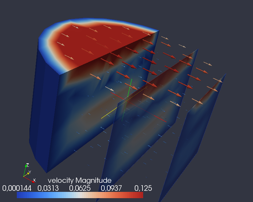
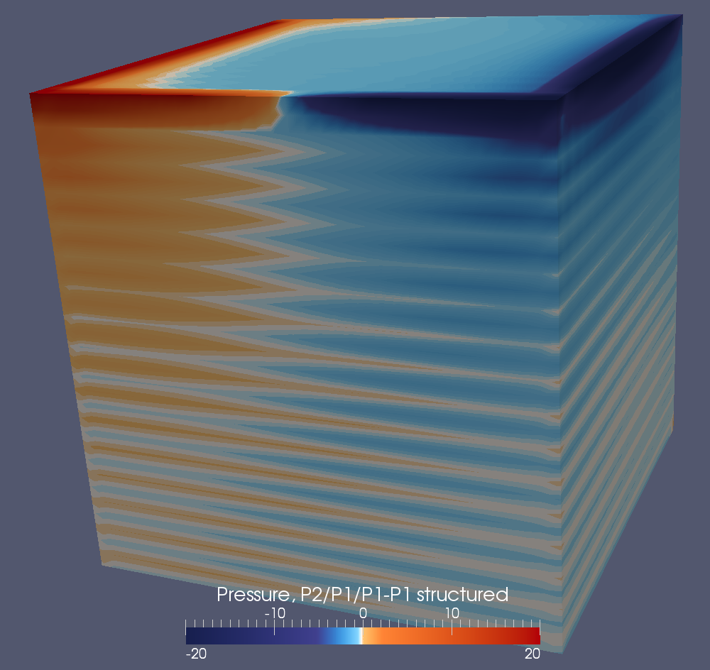
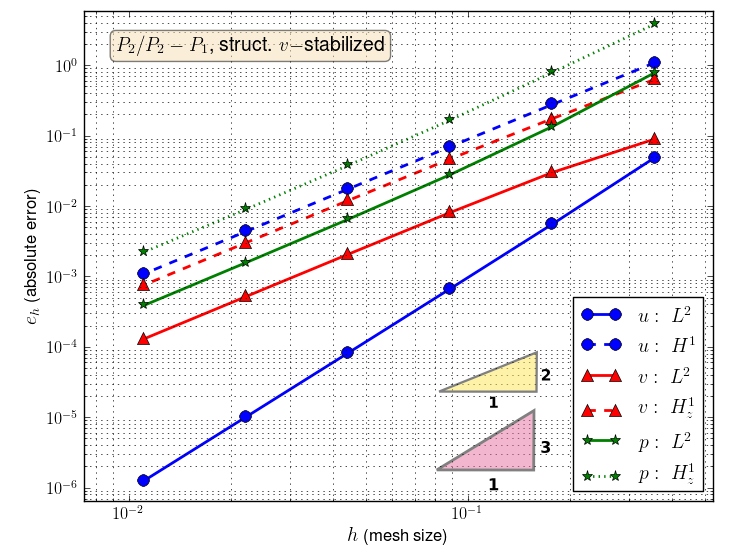
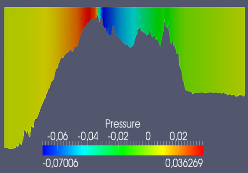

  

      <ul class="nav">
          <li><a href="{{ BASE_PATH }}/assets/rrgalvan_cv.pdf">cv</a></li>
          <li><a href="https://github.com/rrgalvan">github</a></li>
          <li><a href="https://www.researchgate.net/profile/J_Rafael_Galvan">researchgate</a></li>
      </ul>
  

**Website under construction!**

<table class="wide">
<tr>
  <td class="left">
    <!-- <a href="pages/publpics/iplotCorr.html"> -->
        
    <!-- </a> -->
  </td>
  <td class="right">
    <!-- <a href="pages/publpics/tian2016_fig4.html"> -->
        
    <!-- </a> -->
  </td>
</tr>
<tr>
  <td class="left">
    <!-- <a href="pages/publpics/samplemixups_fig7.html"> -->
        
    <!-- </a> -->
  </td>
  <td class="right">
    <!-- <a href="pages/publpics/isletc6_fig4.html"> -->
        
    <!-- </a> -->
  </td>
</tr>
</table>

  

      <ul class="nav">
          <li><a href="morefigs.html">see more figures</a></li>
      </ul>
  

